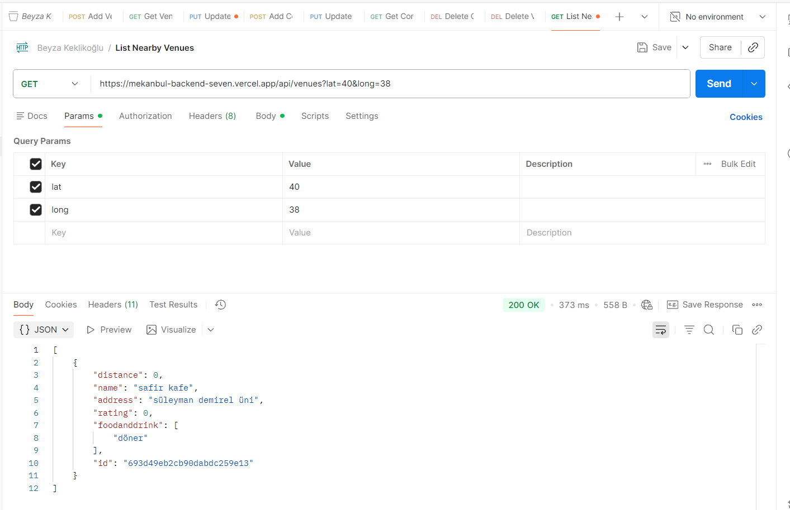
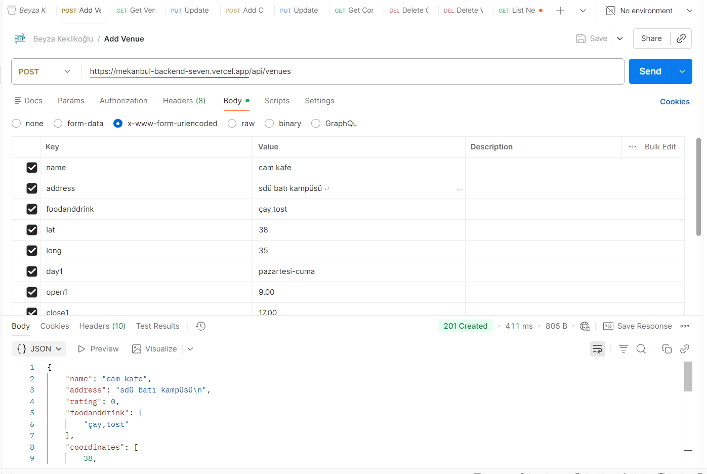
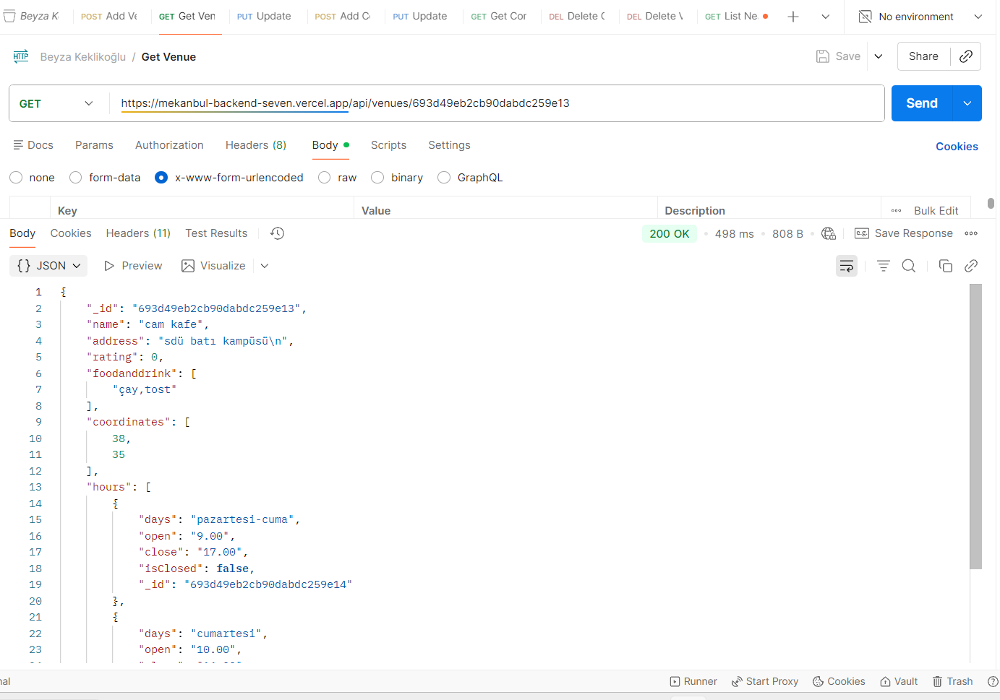
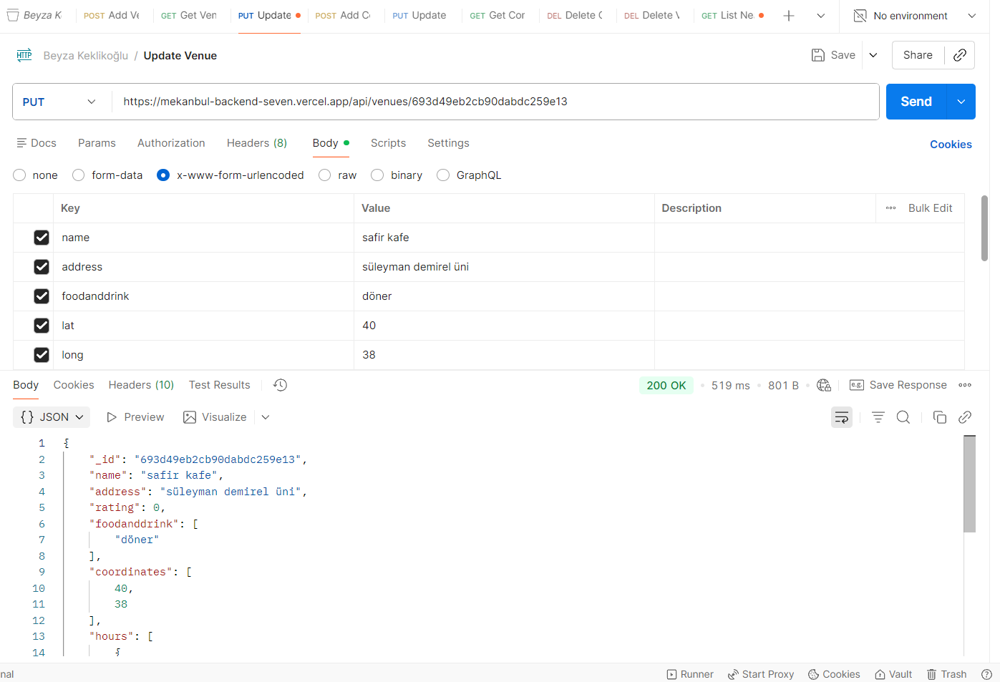
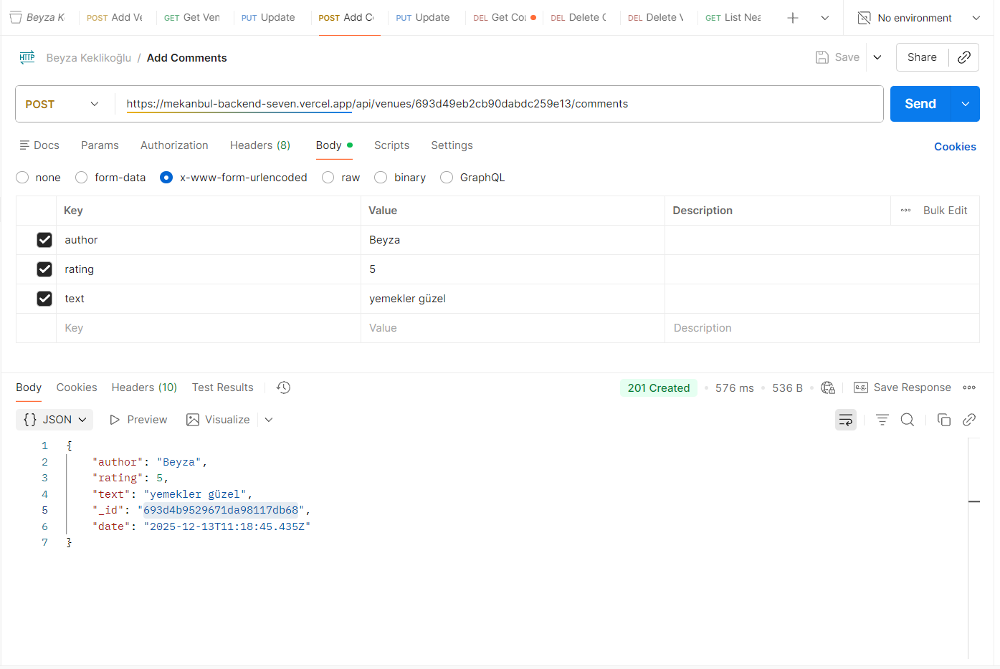
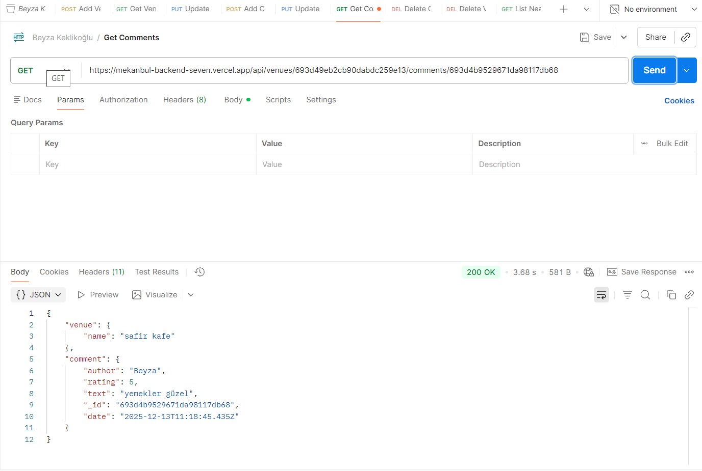
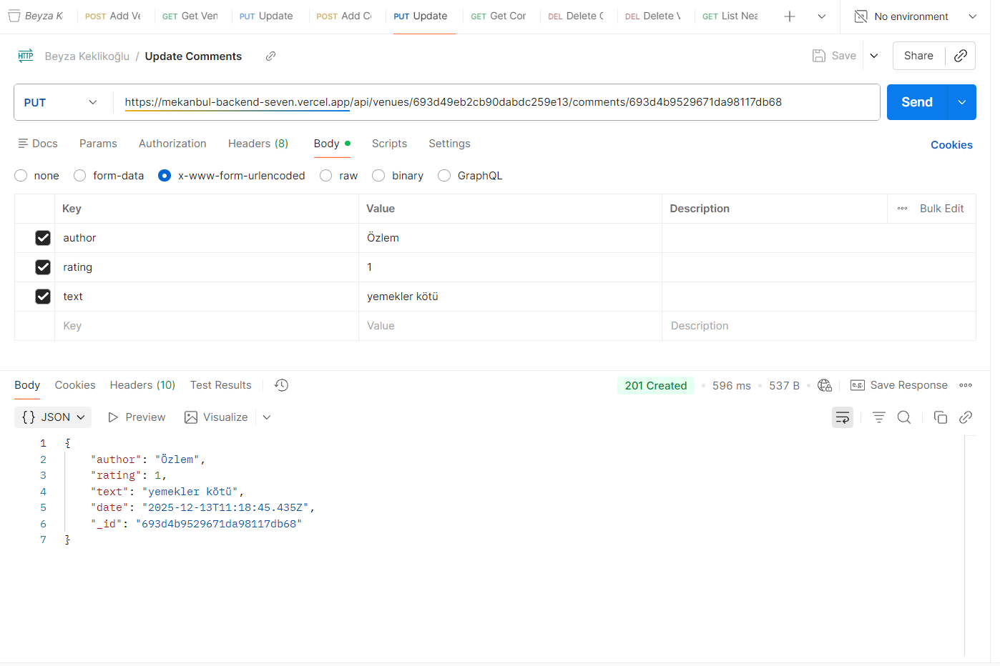
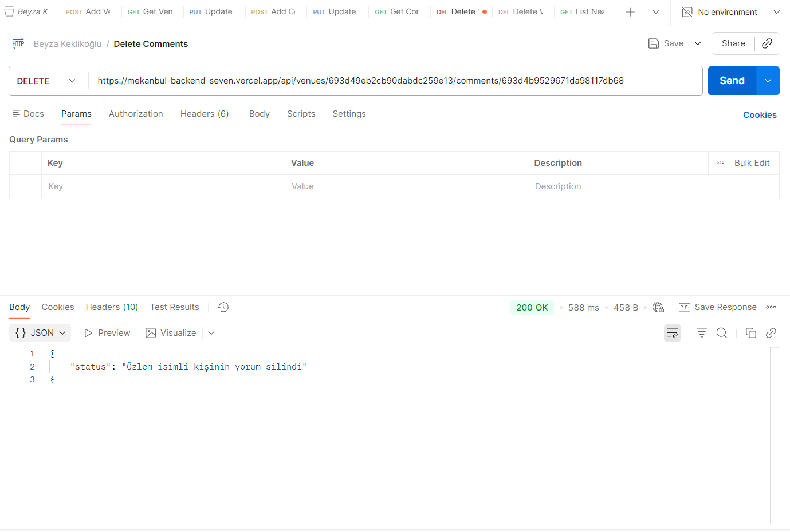

# Mekanbul Backend API

Node.js, Express ve MongoDB kullanılarak geliştirilmiş; mekanları ve bu mekanlara ait yorumları yöneten bir RESTful API.

## Canlı Yayın (Vercel)

Temel URL (Vercel):

- [https://mekanbul-backend-seven.vercel.app](https://mekanbul-backend-seven.vercel.app)

Tüm API endpointleri `/api` prefix'i altında yayınlanır.

---

## API Endpointleri

### Mekanlar (Venues)

- `GET /api/venues`
  - Verilen koordinatlara en yakın mekanları listeler.
  - Query parametreleri:
    - `lat` (number) – enlem
    - `long` (number) – boylam

- `POST /api/venues`
  - Yeni bir mekan oluşturur.
  - Gövde (body) alanlarından beklenenler (örnek):
    - `name` (string)
    - `address` (string)
    - `foodanddrink` (string dizi)
    - `lat` (number)
    - `long` (number)
    - `day1`, `open1`, `close1`, `isclosed1` (ilk çalışma günü bilgileri)
    - `day2`, `open2`, `close2`, `isclosed2` (ikinci çalışma günü bilgileri)

- `GET /api/venues/:venueid`
  - Belirli bir mekanın detaylarını döner.

- `PUT /api/venues/:venueid`
  - Var olan bir mekan kaydını günceller.
  - `POST /api/venues` ile benzer alanları bekler (isim, adres, koordinatlar, çalışma saatleri vb.).

- `DELETE /api/venues/:venueid`
  - İlgili mekanı siler.

### Yorumlar (Comments)

- `POST /api/venues/:venueid/comments`
  - İlgili mekana yeni bir yorum ekler.
  - Gövde (body) alanları:
    - `author` (string)
    - `rating` (number, 0–5)
    - `text` (string)

- `GET /api/venues/:venueid/comments/:commentid`
  - Belirli bir mekana ait tek bir yorumun detayını getirir.

- `PUT /api/venues/:venueid/comments/:commentid`
  - Mevcut bir yorumu günceller.

- `DELETE /api/venues/:venueid/comments/:commentid`
  - Bir yorumu siler ve mekanın ortalama puanını tekrar hesaplar.

---

## Postman Koleksiyonu

Testler için kullanılan Postman koleksiyonu proje kök dizininde bulunur:

- Beyza Keklikoğlu.postman_collection.json

Bu dosyayı Postman'e import ederek istekleri hem lokal sunucuya hem de Vercel üzerinde çalışan API'ye gönderebilirsiniz.

---

## Postman Test Sonuçları (Ekran Görüntüleri)

Başarılı Postman isteklerine ait ekran görüntüleri `tests` klasöründe tutulmaktadır:

| Yakındaki Mekanları Listeleme |
|-------------------------------|
|  |

| Mekan Ekleme | Mekan Getirme |
|--------------|---------------|
|  |  |

| Mekan Güncelleme | Mekan Silme |
|-------------------|------------|
|  |  |

| Yorum Ekleme | Yorum Getirme |
|--------------|---------------|
|  |  |

| Yorum Güncelleme | Yorum Silme |
|-------------------|------------|
|  |  |

Bu görseller, her endpoint için başarılı istek/cevap örneklerini görmenize yardımcı olur.

---

## Lokal Geliştirme (Getting Started)

1. Bağımlılıkları yükleyin:
   - `npm install`
2. MongoDB bağlantısını ayarlayın ve veritabanının çalıştığından emin olun.
   - Bağlantı ayarları `app_api/models/db.js` dosyasında `MONGODB_URI` üzerinden yapılır.
3. Sunucuyu başlatın:
   - `npm start`
4. Varsayılan olarak uygulama, `bin/www` dosyasında belirtilen portta (genellikle `http://localhost:3000`) çalışır.

Lokal test yaparken, canlı adres yerine kendi base URL'nizi (ör. `http://localhost:3000`) kullanarak aynı API path'lerini çağırabilirsiniz.

---

## Ortam Değişkenleri (MongoDB)

Uygulama, MongoDB bağlantı bilgisini `MONGODB_URI` ortam değişkeninden okur.

- Lokal geliştirme: Proje kök dizininde `.env` dosyası oluşturup örneğin şu şekilde tanımlayabilirsiniz:
  - `MONGODB_URI=mongodb://localhost/venuedb`
  - veya Atlas URI'niz: `MONGODB_URI=mongodb+srv://.../venuedb`
- Vercel yayını: Aynı `MONGODB_URI` değerini Vercel projenizin **Environment Variables** kısmına ekleyin ki,
  `https://mekanbul-backend-seven.vercel.app` üzerindeki API aynı veritabanına bağlanabilsin.

Bu URI'nin, bu API tarafından kullanılan `venues` koleksiyonunu içeren veritabanını işaret ettiğinden emin olun.